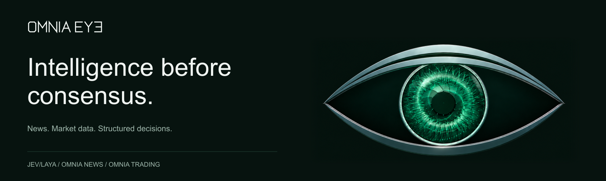

<picture>
  <source media="(prefers-color-scheme: dark)" srcset="assets/profile-banner-dark.png">
  <source media="(prefers-color-scheme: light)" srcset="assets/profile-banner-light.png">
  
</picture>

  <a href="https://www.eyeomnia.com/">Website</a> &nbsp;·&nbsp;
  <a href="https://www.eyeomnia.com/docs/">Documentation</a> &nbsp;·&nbsp;
  <a href="https://x.com/Omniaeye">Follow on X</a>

We build software that connects public information, market observations and structured AI decisions. Explore the decision engine, applications and infrastructure behind **OMNIA EYE**.

### Three repositories. One vision.

| Project | What it does | Explore |
| :--- | :--- | :--- |
| **[JEV/LAYA](https://github.com/Omniaeye/omnia-laya)** | Local AI with typed answers, evidence lineage and durable replay. | [Quickstart](https://github.com/Omniaeye/omnia-laya#quickstart) · [Architecture](https://github.com/Omniaeye/omnia-laya#the-decision-path) |
| **[OMNIA News](https://github.com/Omniaeye/omnia-news)** | Evaluate source content, filter noise and retain the evidence behind feed decisions. | [Quickstart](https://github.com/Omniaeye/omnia-news#quickstart) · [Parameters](https://github.com/Omniaeye/omnia-news/blob/main/docs/PARAMETERS.md) |
| **[OMNIA Trading](https://github.com/Omniaeye/omnia-trading)** | Assess market, holder, liquidity and risk observations through explicit rules. | [Quickstart](https://github.com/Omniaeye/omnia-trading#quickstart) · [Parameters](https://github.com/Omniaeye/omnia-trading/blob/main/docs/PARAMETERS.md) |

### Built around evidence

**Preserve the source.** Keep identity, authorship, observation time and evidence references with the data.

**Make decisions inspectable.** Record the inputs, criteria and policy behind each assessment.

**Keep responsibilities clear.** Collection, assessment, publication and execution have explicit boundaries.

### Explore the foundation

- **[Data Stream](https://github.com/Omniaeye/data-stream-multichain)** — Multichain observations, token identity and visual context.
- **[Frontend Design](https://github.com/Omniaeye/frontend-design)** — Interfaces, motion and interaction design.

<strong>Architecture and engineering</strong>

- [JEV/LAYA research foundations](https://github.com/Omniaeye/omnia-laya#research)
- [News architecture](https://github.com/Omniaeye/omnia-news/blob/main/docs/ARCHITECTURE.md) and [operations](https://github.com/Omniaeye/omnia-news/blob/main/docs/OPERATIONS.md)
- [Trading operations](https://github.com/Omniaeye/omnia-trading/blob/main/docs/OPERATIONS.md) and [parameter catalog](https://github.com/Omniaeye/omnia-trading/blob/main/docs/PARAMETERS.md)
- [News checks](https://github.com/Omniaeye/omnia-news/actions/workflows/checks.yml) · [Trading checks](https://github.com/Omniaeye/omnia-trading/actions/workflows/checks.yml) · [JEV/LAYA checks](https://github.com/Omniaeye/omnia-laya/actions/workflows/omnia.yml)

JEV/LAYA is OMNIA EYE's independent integration fork of [Laya](https://github.com/NandhaKishorM/laya). Original upstream attribution is preserved in the repository.

---

**Explore the code. Follow the development.**

© 2026 OMNIA EYE.
