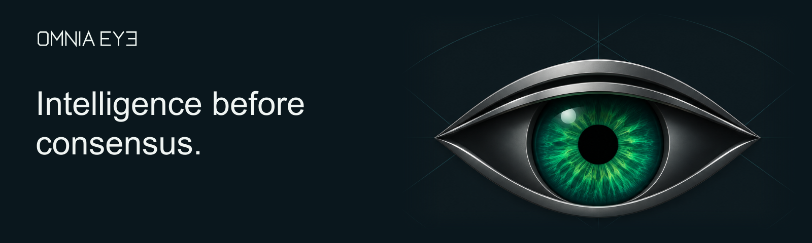

  <a href="https://www.eyeomnia.com/">Website</a> &nbsp;·&nbsp;
  <a href="https://www.eyeomnia.com/docs/">Documentation</a> &nbsp;·&nbsp;
  <a href="https://x.com/Omniaeye">X</a>

**OMNIA EYE develops software for market research.** Our platform brings company news, public conversations and on-chain activity into one workspace.

### Software

#### [JEV/LAYA](https://github.com/Omniaeye/omnia-laya)

Local AI for classification and scoring. Applications define the questions and accepted answer types. The engine validates the answers and records each decision for later inspection and replay.

[Get started](https://github.com/Omniaeye/omnia-laya#quickstart) · [Architecture](https://github.com/Omniaeye/omnia-laya#the-decision-path)

#### [OMNIA News](https://github.com/Omniaeye/omnia-news)

Decide what belongs in a news feed. Evaluate posts, articles and GitHub updates against a configurable publication policy. Each record receives a **keep**, **suppress** or **review** decision, with the original author and context attached.

[Get started](https://github.com/Omniaeye/omnia-news#quickstart) · [Parameters](https://github.com/Omniaeye/omnia-news/blob/main/docs/PARAMETERS.md)

#### [OMNIA Trading](https://github.com/Omniaeye/omnia-trading)

Assess price, volume, liquidity, holder concentration and token risk. A **102-field input catalog** defines how observations are checked, with configurable thresholds and asset identification for **Robinhood Chain, BSC and Solana**.

[Get started](https://github.com/Omniaeye/omnia-trading#quickstart) · [Parameters](https://github.com/Omniaeye/omnia-trading/blob/main/docs/PARAMETERS.md)

### Data and interfaces

| Repository | Focus |
| :--- | :--- |
| [**Data Stream**](https://github.com/Omniaeye/data-stream-multichain) | Multichain token observations and interactive data visualization. |
| [**Frontend Design**](https://github.com/Omniaeye/frontend-design) | OMNIA EYE interface design, motion and interaction. |

---

© 2026 OMNIA EYE.
